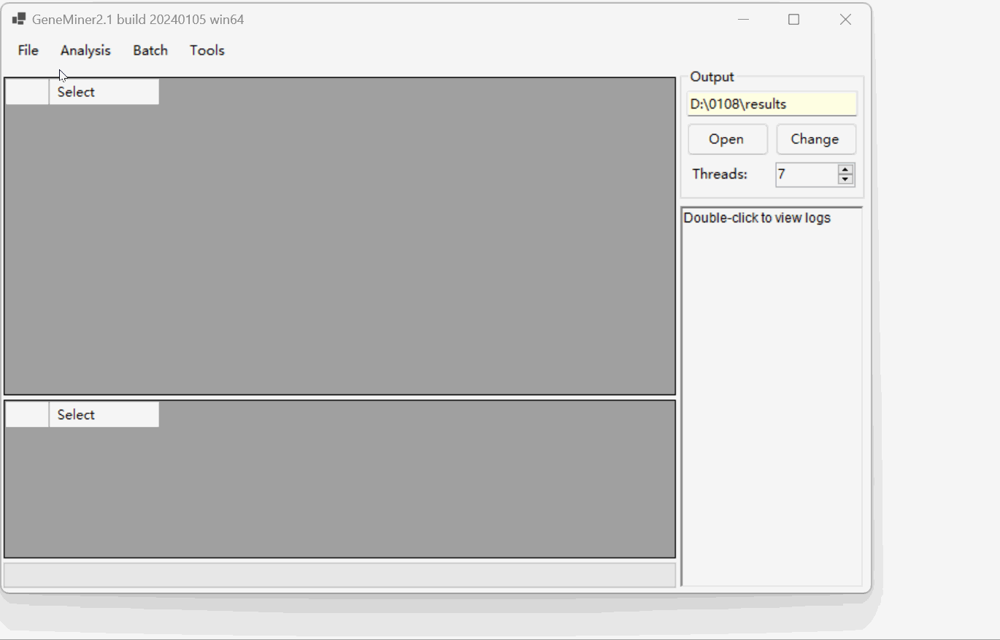

# Tutorial 1 - A Quick Tutorial For General Use

### Data Preparation

- **[Sequencing Data](DATA/seq/)**: Second-generation sequencing data files, in .gz or .fq format.

- **[Reference Sequence](DATA/A_lyrata/)**: Reference gene sequences from closely related species in fasta or genbank format.
 

### Loading the data files

Click [File>Load Sequencing Files]  select sequencing data file.

Click [File>Load Reference] select  fasta format reference sequence file. 

The imported files display details such as reference sequence ID, gene name, number of sequences, and average sequence length.

### Obtain Genes

Click [Analysis > Filter & Assemble] to obtain Genes.

**NOTE:** Do not manually close the command line window; it will close automatically once the process is complete.

NOTE: For importing multiple pairs of sequencing files, select [Batch > Filter & Assemble] to extract.

Click [Open] to view the  results located in the 'results' folder.

