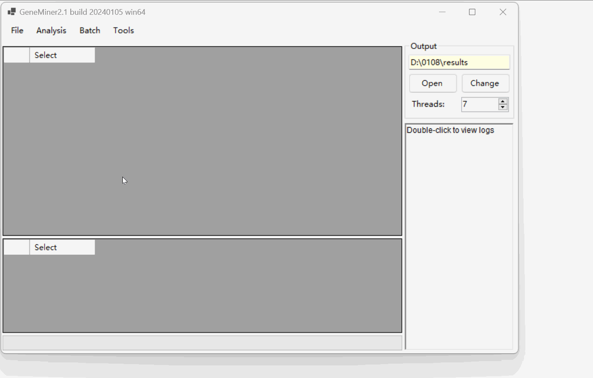
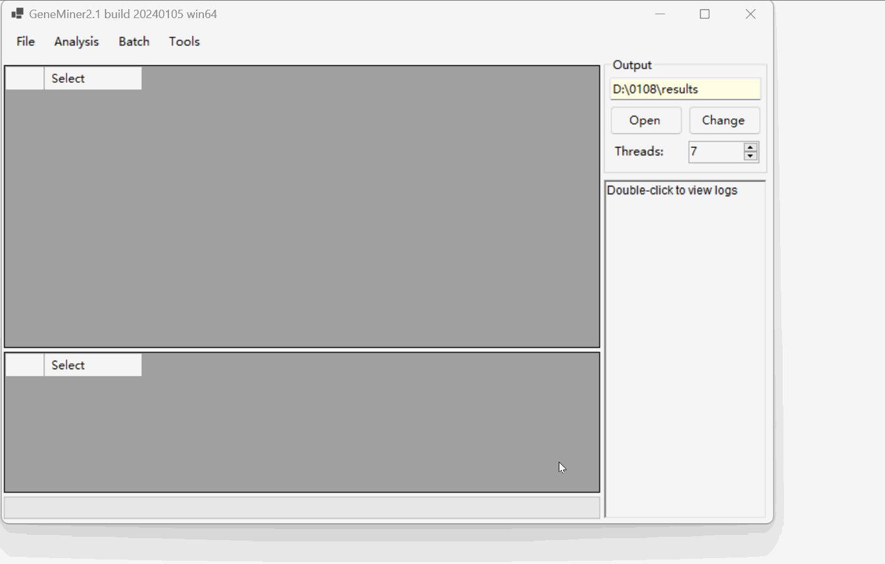
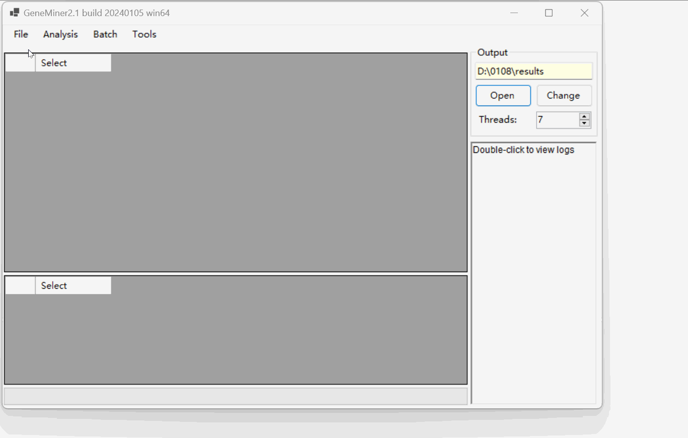

# DEMO2 - For Obtaining Organelle Genes (Genome)

---
## Genes

### Data Preparation

- **[Sequencing Data](DATA/PLANT/GENE/)**: Second-generation sequencing data files, in .gz or .fq format.

- **[Reference Sequence](DATA/ref/OK166971.gb)**: Reference gene sequences from closely related species in fasta or genbank format.

### Loading the data files

Click [File>Load Sequencing Files] select sequencing data file.

Click [File>Load Reference] select  genbank format reference sequence file. 

Confirm to report the file as a gene list.

Optionally, expand the left or right intronic regions [Extend Left][Extend Right].

The imported files display details such as reference sequence ID, gene name, number of sequences, and average sequence length.

## Obtaining Genes
Click [Analysis > Filter & Assemble] to obtain Genes.

**NOTE:** Do not manually close the command line window; it will close automatically once the process is complete.

NOTE: For importing multiple pairs of sequencing files, select [Batch > Filter & Assemble] to extract.

Click [Open] to access the  results located in the 'results' folder.

---

## Genomes

### Data Preparation

- **[Sequencing Data](DATA/PLANT/GENOME/)**: Second-generation sequencing data files, in .gz or .fq format.

### Loading the data files

Click [File>Load Sequencing Files] select sequencing data file.

### Obtaining Plant Chloroplast Genome

Click [Analyse>Plant Chloroplast Genome] to download the reference genome of closely related species.

Click [OK] proceed with the default parameters for assembly.

NOTE: For importing multiple pairs of sequencing files, select [Batch > Plant Chloroplast Genome] to extract.

Click [Open] to view the  results located in the 'Organelle' folder named "Gennome_cp.fasta".

### Obtaining Plant Mitochondrial Genome

Follow the same process as the Plant Chloroplast Genome assembly. However, initially **import the results of the previous Plant Chloroplast Genome** assembly.

Click [Analyse>Plant Mitochondrial Genome] to download the reference genome of closely related species.

Click [OK] proceed with the default parameters for assembly.

Click [Open] to view the  results located in the 'Organelle' folder named "Gennome_mito_plant.fasta"

---
