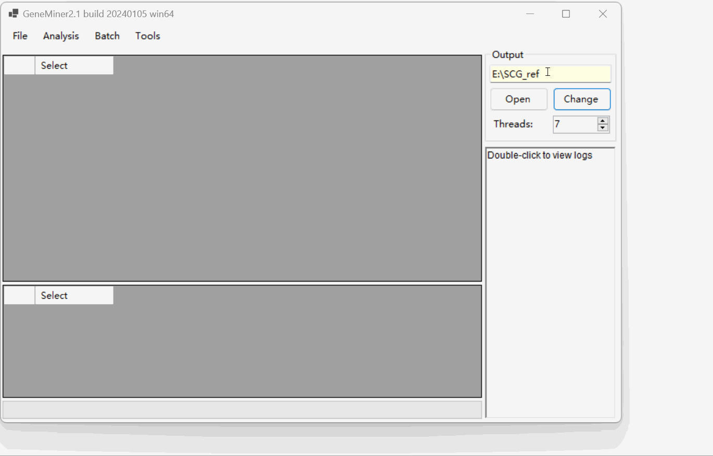
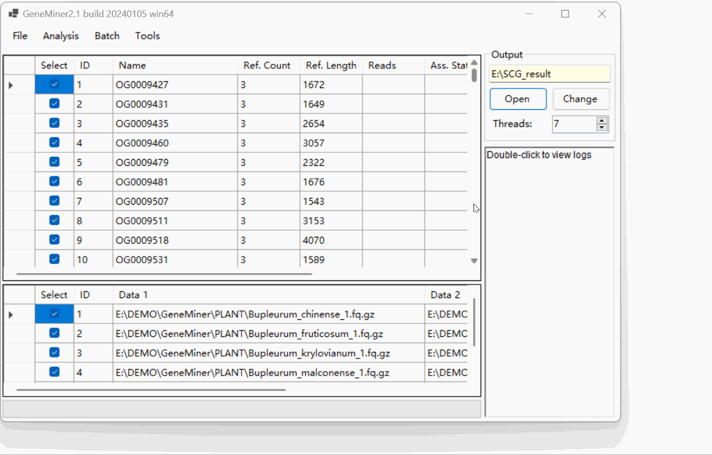

# DEMO 3 - Obtain Single Copy Genes

### Data Preparation

- **[Sequencing Data](DATA\PLANT)**: Second-generation sequencing data files, in .gz or .fq format.

- **[Transcript Data](DATA\Phytozome)**: Assembled transcript data from a closely related species, obtained post-transcriptome assembly, in .fa format

### Loading the data files

Click [File > Load References] select all Transcript Data .

Click [Analysis > Find Single Copy Genes] to get SCG reference.

### Obtaining Single Copy Genes

Click [File > Load References] select the SCG (Single-Copy Gene) reference you have obtained.

Click [File > Load Sequencing Files] to import Sequencing Data in batch

Click [Change] to modify the folder for results.

Click [Batch > Filter & Assemble] to obtain Single Copy Genes.

**NOTE:** Do not manually close the command line window; it will close automatically once the process is complete.

NOTE: When importing a pair of sequencing files, click [Analyse > Filter & Assemble] to obtain Single-Copy Genes.

Click [Open] to view the SCG (Single-Copy Gene) results located in the 'result' folder under the sequence name directory.

