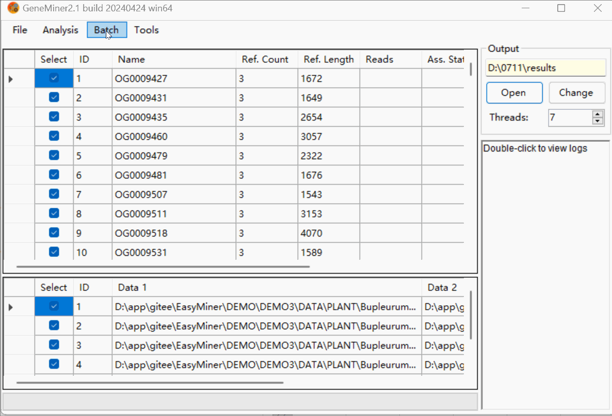
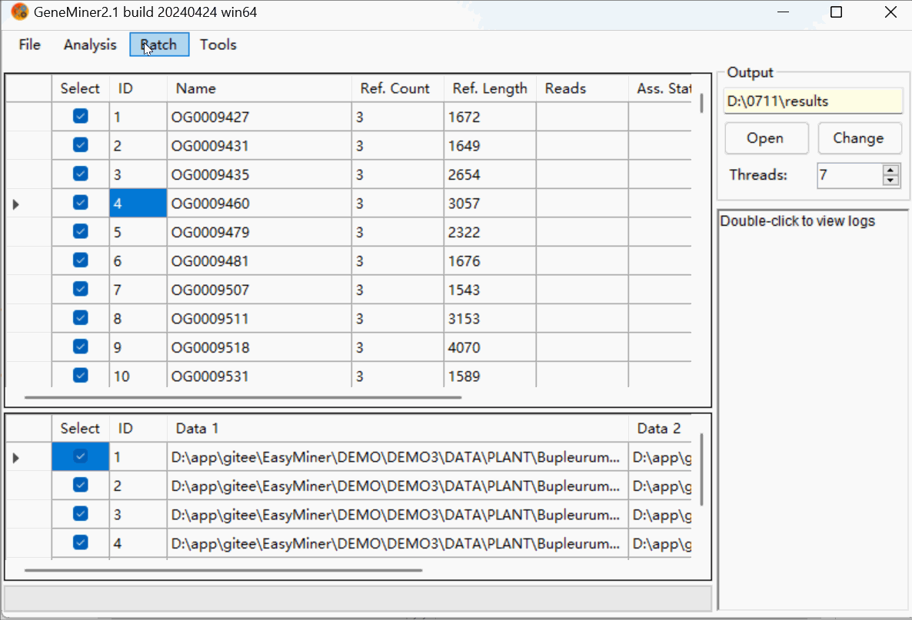
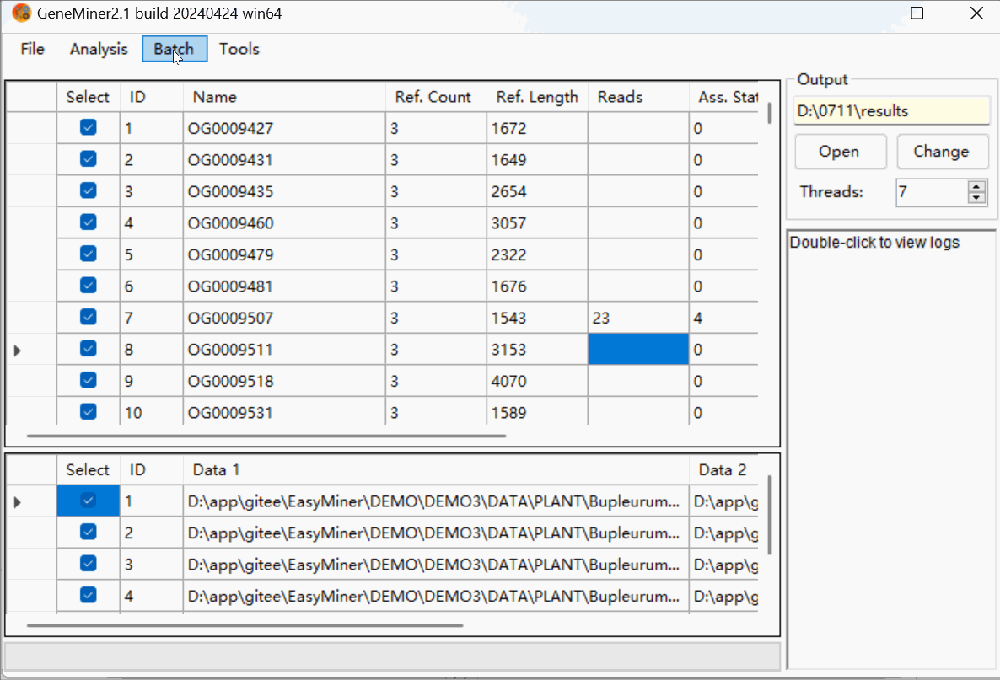

# Tutorial 3 - Tree Construction Process for Single-Copy Genes

### Data Preparation

- **[Sequencing Data](DATA/PLANT/)**: Second-generation sequencing data files, in .gz or .fq format.

- **[Transcript Data](DATA/Phytozome/)**: Assembled transcript data from a closely related species, obtained post-transcriptome assembly, in .fa format

### Obtaining Single Copy Genes Reference Sequences

Click [**File > Load References**] select all **Transcript Data** .

Click [**Analysis > Find Single Copy Genes**] to get SCG reference.

### Obtaining Single Copy Genes

Click [Change] to modify the folder for results.

Click [**File > Load References**] select the SCG (Single-Copy Gene) reference you have obtained.

Click [**File > Load Sequencing Files**] to import **Sequencing Data** in batch

Click [**Batch > Filter & Assemble**] to obtain Single Copy Genes.

**NOTE:** Do not manually close the command line window; it will close automatically once the process is complete.

NOTE: When importing a pair of sequencing files, click [Analyse > Filter & Assemble] to obtain Single-Copy Genes.

Click [Open] to view the SCG (Single-Copy Gene) results located in the 'results' folder under the sequence name directory.

### Data Cleaning

Click [**Batch > Trim With Reference**]to remove two segments of low-quality sequence. 

[**Retention Length Threshold**] can be adjusted based on the data source to prevent over-filtering.

The trimming results can be previewed in the 'BLAST' folder.

Click [**Batch > Combine Results**]. 

[**Maximum difference**] and [**Number of sequeces**] can be adjusted to filter sequences after alignment and trimming.

The filered results can be previewed in the 'combined_*' files and folders.

'combined_results.fasta','combined_trimed.fasta' stores **concatenated sequences**.

### Building Phylogenetic Tree

Click [**Batch > Build Phylogenetic Tree**]. 

The type of phylogenetic tree to be constructed can be selected, and if a rooted tree is required, an outgroup must be chosen.

