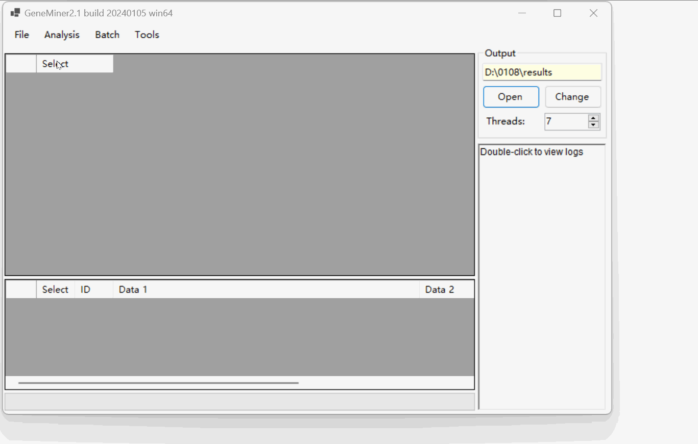

# Tutorial 4 - For Obtaining Angiosperms353 Genes

### Data Preparation

- **[Sequencing Data](DATA/)**: Second-generation sequencing data files, in .gz or .fq format.
 

### Loading the data files

Click [File>Load Sequencing Files]  select sequencing data file.

Click [File > Download Reference >  Angiosperms353 Genes] download reference sequence file from closely related species , in fasta format.

### Obtaining Angiosperms353 Genes

Click [Analysis > Filter & Assemble] to obtain Genes.

**NOTE:** Do not manually close the command line window; it will close automatically once the process is complete.

NOTE: For importing multiple pairs of sequencing files, select [Batch > Filter & Assemble] to extract.

Click [Open] to view the  results located in the 'results' folder.

