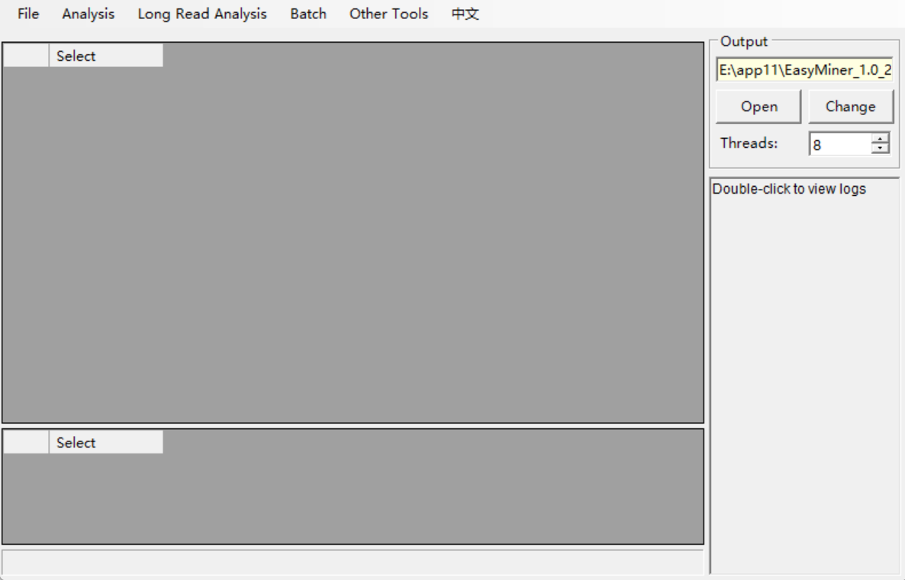
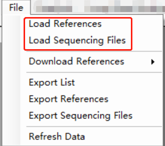
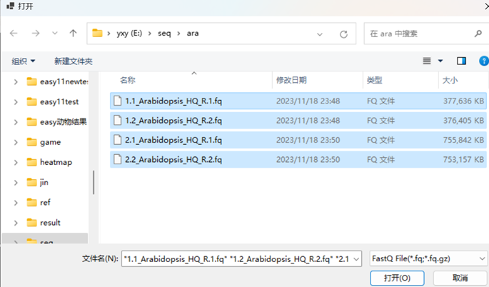
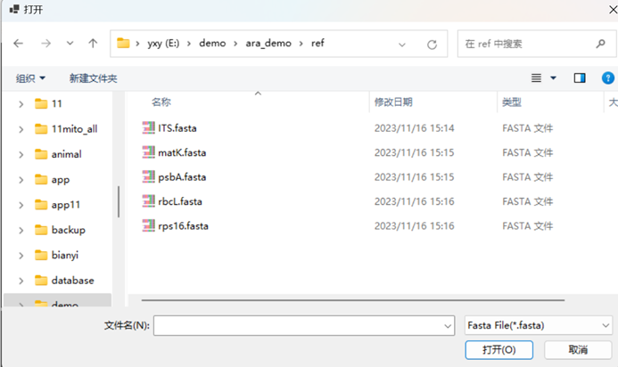
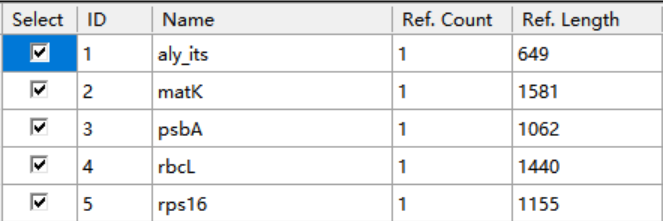
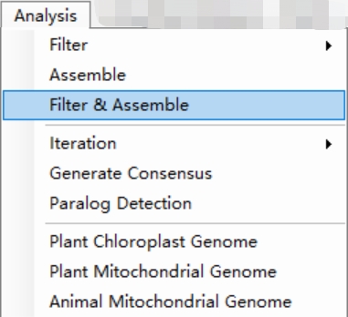
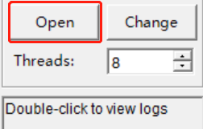

# Overview

EasyMiner是基于我们前期开发的[Easy353](https://github.com/plant720/Easy353)和[GeneMiner](https://github.com/sculab/GeneMiner)，在Windows上设计的增强版本。EasyMiner具有用户友好的Windows图形界面，可在个人电脑上高效准确地进行分子标记提取，无需依赖服务器。EasyMiner通过特别设计的拼接算法，能基于近源物种的参考基因从二代测序中快速准确的提取分子标记，并同时兼具细胞器基因组组装、genbank文件中基因序列分解、识别旁系同源基因等功能。
 
EasyMiner is an enhanced version of our previous developments [Easy353](https://github.com/plant720/Easy353) and [GeneMiner](https://github.com/sculab/GeneMiner), running on Windows. EasyMiner features a user-friendly Windows graphical interface for efficient and accurate extraction of molecular markers on personal computers, without the need for a server. By using specially designed stitching algorithms, EasyMiner can quickly and accurately extract molecular markers from second-generation sequencing based on reference genes from closely related species, while also providing functions for cell organelle genome assembly, gene sequence decomposition in genbank files, and  the identification of paralogs.
# Dependencies

[.NET 6.0 Desktop Runtime](https://dotnet.microsoft.com/zh-cn/download/dotnet/thank-you/runtime-desktop-6.0.21-windows-x64-installer)

# Download and install

EasyMiner is an easy-to-use software written in vb.net and python3, which is ONLY provided for Windows 64-bit systems.

Download the corresponding version from [here](http://life-bioinfo.tpddns.cn:8445/database/app/EasyMiner/).

You can also download from [SourceForge](https://sourceforge.net/projects/scueasyminer/).

## Command Line (cmd)

For users who want to use command line version, Please see our [Easy353](https://github.com/plant720/Easy353) and [GeneMiner](https://github.com/sculab/GeneMiner)

# Usage

### note:The detailed usage and tutorials can be found at [here](https://github.com/sculab/EasyMiner/blob/master/manual/ZH_CN/Manual_CH.pdf).
This example shows how to extract specific genes from second-generation sequencing files of *Arabidopsis thaliana* using gene sequences from the closely related species *Arabidopsis lyrata* as reference.

**Data Preparation**:

All example files mentioned below are available in
[DEMO · sculab/EasyMiner - 码云 - 开源中国 (gitee.com)](https://gitee.com/sculab/EasyMiner/tree/master/DEMO)

Alternatively, you can prepare your own:

**1) Sequencing Data**: Second-generation sequencing data files, in .gz or .fq format.

**2) Reference Sequence**: Reference gene sequences from closely related species in fasta or genbank format. For fasta format.
 

**Load Data**: 

Click **[File>Load Sequencing Files]** to select sequencing data file。

**Note**: For paired (paired) sequence files, you need to select two (even numbered) data files at the same time and load them together, if only one is selected, it will be loaded as single-ended sequencing data.

Click **[File>Load Reference]** to select a reference sequence file in fasta format, and you can select multiple reference sequence files at once.

 

The imported files display information such as the ID of the reference sequence, gene name, number of sequences and average length of the sequence.

**Running Programme**

Click **[Analyse>Filter&Splice]** to run the programme with default parameters and wait for the programme to finish.

**Note: Do not close the command line window manually, please wait patiently for the window to close automatically.** 

 

**View Results**

Click on the **"Open"** button to view the results file. The assembled files are saved in the **results** directory in fasta format.

See the Gitee homepage for more examples.
Whole page of manual click [here](D:\app\Gitee_easyminer\EasyMiner\manual\ZH_CN\readmeall.pdf)

# Questions
**1.** **What is the meaning of filter depth in the result list?**

The list shows the theoretical maximum depth that can be achieved if all reads are used for splicing, which is much larger than the actual splicing depth.

**2.** **How is the assembly kmer value determined?**

All read-length sequences are compared with the reference sequence, and the length of its largest common sequence is calculated as the Kmer value.

**3.** **Does sequencing data require the removal of junctions and low-quality reads?**

It is recommended to use the HQ version of the data provided by the sequencing company, using low-quality data may lead to poor extraction results. If HQ data is not available it is recommended to remove joints and low-quality reads.

**4.** **Possible reasons and solutions for not getting the result sequence?**

The selected reference sequence is not close enough to the source (manually find a more close sequence)

The depth of the sequencing data is too shallow (try turning down the filter K value)

Try iterative re-analysis

*The results obtained by lowering the kmer may not be accurate enough, for false positives and other erroneous sequences, you need to manually filter and distinguish them.

**5. What is the memory requirement of the software?**
The software does not require much memory, you can adjust the number of processes to fit the memory of your computer.

**6. How do I get the intron sequence data?**
Firstly, get the complete gb file by [Analyse>Plant Chloroplast Genome], then import the gb file,click yes to report file as gene list. Then tick [Exclude Exonic Regions], and choose the length of the intron region in [Extended Boundary Length].

**7. About the cut-and-align function?**
[Batch>Merge&Trim] is to merge and trim the results files in batch. [Other Tools>Trimmed Alignment] is to align and trim the reference sequences you chose in the terminal to the result files.

**8. No results for PPD?**

PPD is only applied for 353 data, please ensure there are three or more species are selected for batch extraction.
*Ensure that there is no Chinese catalog folder.

# Contact
If you have any questions, suggestions, or comments about EasyMiner, feel free to contact the developer at Xinyi_Yu2021@163.com.

