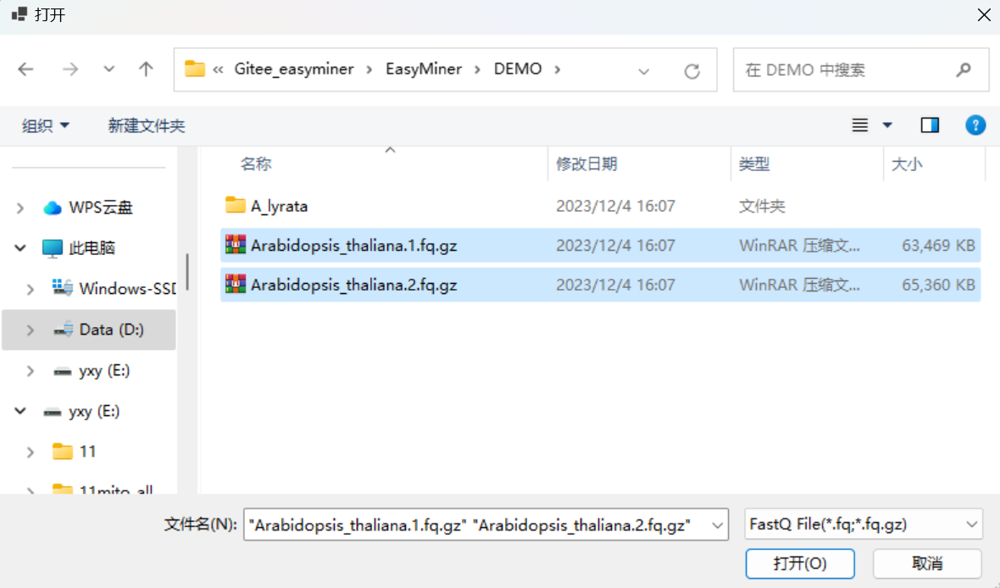

# Overview
For the Chinese version of the manual, click [Here](chinese_README.md).

 

EasyMiner, advancing from its precursors Easy353 and GeneMiner, operates on Windows platforms, enhancing the user experience significantly. It is meticulously crafted with an intuitive Windows graphical interface, facilitating the efficient and precise extraction of molecular markers directly on personal computers, independent of server infrastructure. EasyMiner adeptly processes second-generation sequencing data, utilizing reference genes from genetically akin species. It further extends its capabilities to include plastid genome assembly, decomposition of gene sequences in GenBank files, and the adept identification of paralogs, thereby embodying a comprehensive tool for molecular marker analysis.

# Install
The .NET 6.0 Desktop Runtime x64 must be installed on the computer for proper software functionality.
[.NET 6.0 Desktop Runtime](https://dotnet.microsoft.com/zh-cn/download/dotnet/thank-you/runtime-desktop-6.0.21-windows-x64-installer)

You could download from [SourceForge](https://sourceforge.net/projects/scueasyminer/) or our [site](http://life-bioinfo.tpddns.cn:8445/database/app/EasyMiner/).

# Demo

[DEMO1-Part1](https://gitee.com/sculab/EasyMiner/tree/master/DEMO/DEMO1)

[DEMO2-Part2](https://gitee.com/sculab/EasyMiner/tree/master/DEMO/DEMO2)

  
[DEMO3-For Animal Mitochondrial Genome](https://gitee.com/sculab/EasyMiner/tree/master/DEMO/DEMO3)

[DEMO4-For 353 Genes](https://gitee.com/sculab/EasyMiner/tree/master/DEMO/DEMO4)

# More Details
For detailed instructions and tutorials, visit [here](manual/ZH_CN/readmeall.pdf).

# Command Line (cmd)

For users interested in the command line version, please refer to our [Easy353](https://github.com/plant720/Easy353) and [GeneMiner](https://github.com/sculab/GeneMiner)

---
# Usage

# Part1:How to get specific gene

This section demonstrates how to extract specific genes from second-generation sequencing files of Arabidopsis thaliana, using Arabidopsis lyrata gene sequences as a reference.

### Data Preparation

**1) Sequencing Data**: Second-generation sequencing data files, in .gz or .fq format.

**2) Reference Sequence**: Reference gene sequences from closely related species in fasta or genbank format.
 

**Load Data**
 

Click **[File>Load Sequencing Files]** to select sequencing data file.

**Note**:  For paired sequencing files, select two (even-numbered) data files simultaneously. Single files will be treated as single-end sequencing data.

Click **[File>Load Reference]** to select  fasta format reference sequence files. Multiple files can be chosen at once.

Reference sequences in gb format can also be imported.Confirm to report the file as a gene list.

Optionally, expand the left or right intronic regions [Extend Left][Extend Right].

The imported files display details such as reference sequence ID, gene name, number of sequences, and average sequence length.

### Running Programme

Click **[Analyse>Filter&Assemble]**  to run the program with default parameters.

**Note:** Do not manually close the command line window; it will close automatically once the process is complete.

### View Results

Click **"Open"**  to view the results.

---
# Part2 :How to get plastid genome
This example demonstrates the process of mining chloroplast and mitochondrial genomes from second-generation sequencing data of *Arabidopsis thaliana*.

**Note:** Assembly of the Plant Chloroplast Genome is required before the Plant Mitochondrial Genome assembly.

## Step1 Plant Chlororplast Genome

### Data Preparation

**Sequencing Data**: Second-generation sequencing data files in .gz or .fq format.

**Load Data**

Click **[File>Load Sequencing Files]** to select sequencing data files.

### Running Programme

Click[**Analyse>Plant_Chloroplast_Genome**]to download the reference genome of closely related species.

Click **OK** and proceed with the default parameters for assembly.

### View Results

Click **"Open"** to view the results. Assembled files are stored in the **Organelle** directory in both gb and fasta formats. 

Specific genes can be extracted from the genome by loading and exporting the gb file:
You can extract specific genes from the genome by loading and exporting the gb file: **[File>Load_reference]**.**[File>Export_reference]**

---

## Step2 Plant mitochondrial genome

Follow the same process as the Plant Chloroplast Genome assembly. However, initially **import the results of the previous Plant Chloroplast Genome** assembly.

---

# Questions

**1.** **Does sequencing data require the removal of junctions and low-quality reads?**

It's recommended to use the high-quality (HQ) version of the data provided by the sequencing company. Using low-quality data may result in less optimal extraction outcomes. If HQ data is not available, removing junctions and low-quality reads is advisable to enhance results.

**2.** **Causes and solutions for the absence of assemble result.**

*The selected reference sequence may not be sufficiently related. (Find a more closely related sequence manually).

*The sequencing data might not be deep enough. (Consider reducing the filter K value or extending the [Reads/File(M)]).

*If the assembly results are not ideal, re-analyze using [Analysis > Iteration].

*Consider reducing the Kmer value during assembly.

**Note:**  Lowering the Kmer value might affect accuracy. Manual discernment of false positive sequences is recommended.

**Note:**  It's advisable to set the Kmer value to be greater than 17 and ensure it's an odd number.

**3.** **What is the memory requirement of the software?**

The software requires minimal memory. Adjust the [Threads] setting according to your computer's memory capacity.

**4.** **How to obtain the intron sequence data?**

Firstly, acquire the gb file via [Analyse > Plant Chloroplast Genome], then import it using [File > Load Reference]. Confirm to report the file as a gene list. Determine the intron region length using [Extend Left] and [Extend Right].

**Note:** If the imported reference CDS includes an internal vacant intron region, the software's analysis will include this vacant intron.

**5.** **No result for  [Merge & Trim]?**

[Batch > Merge & Trim] requires: sequencing data, reference sequences, and a catalog folder where results exist.

**Note:** The ID number in the result folder(3) should match the imported sequencing file ID(2).  
*Ensure there is no Chinese catalog folder.

**6.** **No results for PPD?**

Ensure the selection of three or more species for batch extraction. Ensure there is no Chinese catalog folder.

**7.** **No results for Mitochondrial Genome?**

For mitochondrial genome assembly, it's recommended to utilize the full read length of the sequencing file. Uncheck the [Reads/File(M)] checkbox at [Analysis > Filter] to analyze the full read length data.

# Contact
If you have any questions, suggestions, or comments about EasyMiner, feel free to contact Xinyi_Yu2021@163.com.

