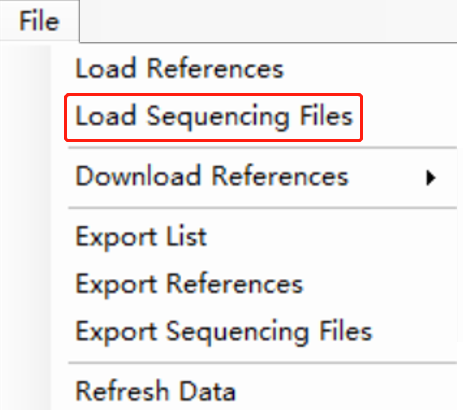
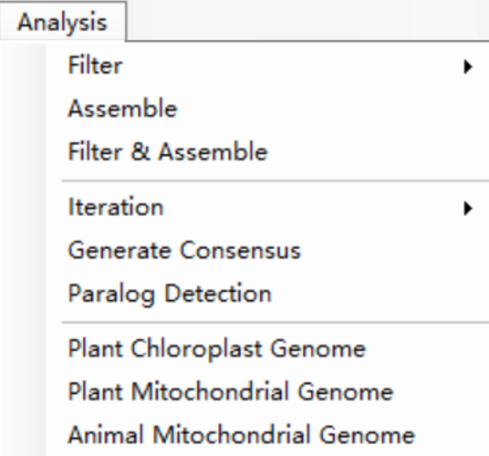

# Overview

 

EasyMiner is an enhanced version of our previous developments [Easy353](https://github.com/plant720/Easy353) and [GeneMiner](https://github.com/sculab/GeneMiner), running on Windows. EasyMiner features a user-friendly Windows graphical interface for efficient and accurate extraction of molecular markers on personal computers, without the need for a server. By using specially designed stitching algorithms, EasyMiner can quickly and accurately extract molecular markers from second-generation sequencing based on reference genes from closely related species, while also providing functions for cell organelle genome assembly, gene sequence decomposition in genbank files, and  the identification of paralogs.

# Dependencies

[.NET 6.0 Desktop Runtime](https://dotnet.microsoft.com/zh-cn/download/dotnet/thank-you/runtime-desktop-6.0.21-windows-x64-installer)

# Download and install

EasyMiner, developed in vb.net and python3, is exclusively available for 64-bit Windows systems.

Download the appropriate version from [here](http://life-bioinfo.tpddns.cn:8445/database/app/EasyMiner/).

Alternatively, download from [SourceForge](https://sourceforge.net/projects/scueasyminer/).

## Command Line (cmd)

For users who want to use command line version, Please see our [Easy353](https://github.com/plant720/Easy353) and [GeneMiner](https://github.com/sculab/GeneMiner)

# Usage

## Part1:How to get specific gene?

This section demonstrates extracting specific genes from second-generation sequencing files of Arabidopsis thaliana, using Arabidopsis lyrata gene sequences as a reference.

**Data Preparation**:

Example files are available at 
[DEMO](https://gitee.com/sculab/EasyMiner/tree/master/DEMO)

Alternatively,  prepare your own:

**1) Sequencing Data**: Second-generation sequencing data files, in .gz or .fq format.

**2) Reference Sequence**: Reference gene sequences from closely related species in fasta or genbank format.
 

**Load Data**: 

Click **[File>Load Sequencing Files]** to select sequencing data file.

**Note**:  For paired sequence files, simultaneously select two (even-numbered) data files for loading. Single files will be treated as single-end sequencing data.

Click **[File>Load Reference]** to select  fasta format reference sequence files. Multiple files can be chosen at once.

Reference sequences in gb format can also be imported.Confirm to report the file as a gene list.
Optionally, expand the left or right intronic regions [Extend Left][Extend Right].

The imported files display information such as the reference sequence ID, gene name, number of sequences, and average sequence length.

 

**Running Programme**
Click **[Analyse>Filter&Assemble]**  to run the program with default parameters.

**Note:** Do not manually close the command line window; please wait patiently for it to close automatically. 

**View Results**

Click **"Open"**  to view the results.
 

## Part2 :How to get plastid genome?
This example covers mining chloroplast and mitochondrial genomes from second-generation sequencing data of Arabidopsis thaliana.

**Note:** Plant Chloroplast Genome assembly is required before Plant Mitochondrial Genome assembly.
### Step1 Plant Chlororplast Genome
**Data Preparation**:

Example files are available at
[DEMO · sculab/EasyMiner - 码云 - 开源中国 (gitee.com)](https://gitee.com/sculab/EasyMiner/tree/master/DEMO)

Alternatively,prepare your own 
**Sequencing Data**: Second-generation sequencing data files, in .gz or .fq format.
 

**Load Data**: 
Click **[File>Load Sequencing Files]** to select sequencing data file.

 
 

**Running Programme**
 
Click **[Analyse>Plant_Chloroplast_Genome]** to download the reference genome of closely related species.

 

Click **OK** and proceed with the default parameters for assembly.

 
 

**View Results**

Click **"Open"** to view the results. Assembled files are stored in the **Organelle** directory in both gb and fasta formats. 
Specific genes can be extracted from the genome by loading and exporting the gb file:
You can extract specific genes from the genome by loading and exporting the gb file: **[File>Load_reference]**.**[File>Export_reference]**

 
 

### Step2 Plant Mitochondrial Genome

Follow the same process as the Plant Chloroplast Genome assembly. However, **import the results of the previous Plant Chloroplast Genome** assembly first.

 
 

# Questions
**1.** **Does sequencing data require the removal of junctions and low-quality reads?**
It is recommended to use the HQ version of the data provided by the sequencing company. Utilizing low-quality data may lead to suboptimal extraction outcomes. In the absence of HQ data, it is recommended to remove junctions and low-quality reads to improve results.

**2.** **Causes and solutions for the absence of resultant sequences.**
*The selected reference sequence may not be sufficiently related to the source. (Manually find a more closely related sequence).

*The depth of the sequencing data might be inadequate. (Consider reducing the filter K value or extending the [Reads/File(M)]).

*Undertake a re-analysis using [Analysis > Iteration] for potentially longer sequence results.

*Reduce the Kmer value during assembly.

**Note:** Be aware that results obtained with a lowered Kmer value may lack accuracy. Manual discernment of false positive sequences is advised.

**3. What is the memory requirement of the software?**
The software has minimal memory requirements. Adjust the [Threads] setting to match your computer's memory capacity.

**4. How to obtain the intron sequence data?**
Firstly, acquire the gb file via [Analyse > Plant Chloroplast Genome], then import this file using [File > Load Reference]. Confirm to report the file as a gene list. Next, determine the intron region length using [Extend Left] and [Extend Right].

**Note:** If the imported reference cds includes an internal vacant intron region, the software's analysis result will encompass this vacant intron.

**5. No result for  [Merge & Trim]?**

[Batch > Merge & Trim] requires the existence of: sequencing data, reference sequence,  catalogue folder where results exist. 

**Note:** The ID number in the result folder(3) should match the imported sequencing file ID(2).  
*Make sure there is no Chinese catalog folder.

**6. No results for PPD?**
PPD application is limited to 353 data. Ensure the selection of three or more species for batch extraction.
*Make sure there is no Chinese catalog folder.

**7. No results for Mitochondrial Genome?**
For mitochondrial genome assembly, utilizing the full read length of the sequencing file is recommended.
You can untick **[Reads/File(M)]** checkbox at **[Analysis>Filter]** to analyse the full read length data.
 
 

For detailed instructions and tutorials, visit [here](manual\ZH_CN\readmeall.pdf)

# Contact
If you have any questions, suggestions, or comments about EasyMiner, feel free to contact the developer at Xinyi_Yu2021@163.com.

