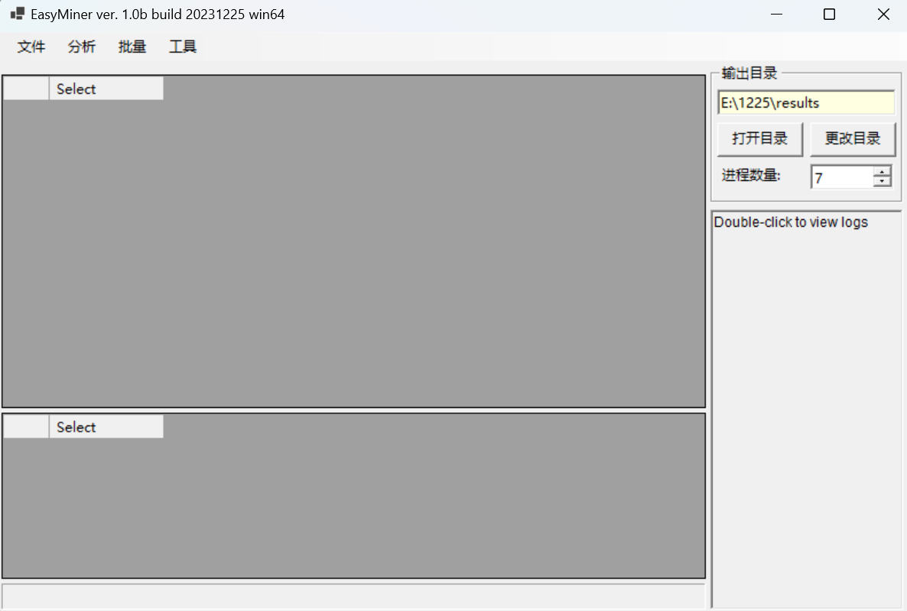

# GeneMiner2: A Comprehensive Toolkit for Phylogenomic Genomics
# 介绍
** [To View README in English](README.md)**

GeneMiner2是一款为系统发育基因组学设计的全功能工具包，软件主要功能包括：
- 从二代测序数据中挖掘单拷贝核基因、质体基因等分子标记
- 将多个分子标记切齐、排序、建立串联和溯祖系统发育树
- 拼接注释动植物质体基因组

用户能够在GeneMiner2中完成从NGS数据获取到系统发育树建立的所有工作。

## 引用
GeneMiner2基于我们之前开发的GeneMiner和Easy353软件，并整合了Blast、Minimap2、Fasttree、Muscle5、Mafft、Astral、PDD、PGA、NOVOPlasty、OrthoFinder等优秀工具，请在使用对应功能时引用软件提示的文献。

GeneMiner2的工作尚未正式发表，目前请引用我们关于GeneMiner的论文：
- Pulin Xie, Yongling Guo, Yue Teng, Wenbin Zhou, Yan Yu. 2024. GeneMiner: a tool for extracting phylogenetic markers from next-generation sequencing data. Molecular Ecology Resources. DOI: 10.1111/1755-0998.13924
如果挖掘被子植物353基因，请引用我们关于Easy353的论文：
- Zhang Z, Xie P, Guo Y, Zhou W, Liu E, Yu Y. 2022. Easy353: A tool to get Angiosperms353 genes for phylogenomic research. Molecular Biology and Evolution 39(12): msac261.

# 安装和需求

GeneMiner2的源代码均保存在github和Gitee上，您可以从下面的地址获取最新的安装包: 

**[SourceForge](http://life-bioinfo.tpddns.cn:8445/database/app/GeneMiner/) 或 [本地镜像](https://sourceforge.net/projects/geneminer/files/)**

如果您需要使用命令行版本的基因挖掘工具，请访问: 

- GeneMiner: https://github.com/sculab/GeneMiner

- Easy353: https://github.com/plant720/Easy353

您也可以使用GeneMiner2上scripts文件夹中的python脚本，这些脚本提供了GeneMiner2的所有核心功能，并可以在Windows、macOS或Linux上部署。

**macOS用户**: 在macOS上运行GeneMiner2时，如果遇到 "XXX 已损坏"之类的错误，请打开终端，运行类似下面的命令:
- xattr -cr **把GeneMiner.app拖放到此处**
- 例如: xattr -cr /Applications/GeneMiner.app

由于GeneMiner2通过wine技术运行在macOS上，运行效率远低于Windows，因此不建议用GeneMiner2在macOS进行大规模的分析。

**Note:** 请勿在移动磁盘上运行GeneMiner2。请勿将GeneMiner2安装到带有中文的文件夹中。

---

# 示例演示

[Tutorial 1 - 快速掌握使用方法](/DEMO/DEMO1/DEMO1.md)

[Tutorial 2 - 获取质体基因组和质体基因](/DEMO/DEMO2/DEMO2.md)

  
[Tutorial 3 - 获取单拷贝基因](DEMO/DEMO3/DEMO3.md)

[Tutorial 4 - 获取被子植物353基因集](DEMO/DEMO4/DEMO4.md)

# 详细说明

有关软件的详细说明以及输出目录解释[请见此处](manual/ZH_CN/readme_more.md)

# 常见问题
[常见问题解答](FAQ_zh_cn.md)

# 联系方式
有关GeneMiner任何建议、问题，请联系邮箱
Xinyi_Yu2021@163.com.