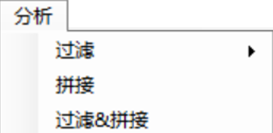

# 安装和需求

EasyMiner是基于.net平台开发的，仅提供x64版本，需要在计算机上安装有.NET 6.0 Desktop Runtime x64。如果不满足需求，软件会在第一次运行时提醒您下载。您也可以从此处获取.NET 6.0 Desktop Runtime x64的安装包: 

https://dotnet.microsoft.com/zh-cn/download/dotnet/thank-you/runtime-desktop-6.0.21-windows-x64-installer

EasyMiner的源代码均保存在github和Gitee上，您可以从此处获取最新的安装包: 

[Index of /database/app/EasyMiner (tpddns.cn)](http://life-bioinfo.tpddns.cn:8445/database/app/EasyMiner/)

或

[EasyMiner download | SourceForge.net](https://sourceforge.net/projects/scueasyminer/)

如果您需要在macOS或Linux上使用命令行版本的基因挖掘工具，请访问: 

Easy353: https://github.com/plant720/Easy353

GeneMiner: https://github.com/sculab/GeneMiner

你也可以使用github上scripts文件夹中的python脚本，这些脚本提供了EasyMiner的所有核心功能，并可以在macOS或Linux上部署。

https://github.com/sculab/EasyMiner

# 依赖环境

[.NET 6.0 Desktop Runtime](https://dotnet.microsoft.com/zh-cn/download/dotnet/thank-you/runtime-desktop-6.0.21-windows-x64-installer)

# 下载和安装

由vb.net和python3开发的EasyMiner只适用于64位Windows系统。

点击这里下载最新版 [here](http://life-bioinfo.tpddns.cn:8445/database/app/EasyMiner/).或 [SourceForge](https://sourceforge.net/projects/scueasyminer/).

# 示例数据

**Demo of Part1**:提取cds所需测序数据，选用拟南芥(*Arabidopsis thaliana*)二代测序数据进行提取，使用近源物种琴叶拟南芥(*Arabidopsis lyrata*)的基因作为参考序列。[DEMO1](https://gitee.com/sculab/EasyMiner/tree/master/DEMO/DEMO1)

**Demo of Part2**:组装植物叶绿体和线粒体基因组所需数据，选用拟南芥二代测序数据。[DEMO2](https://gitee.com/sculab/EasyMiner/tree/master/DEMO/DEMO2)

**Demo3**:动物线粒体基因组拼接所需测序序列，选用红原鸡（*Gallus gallus*）二代测序数据。 [DEMO3](https://gitee.com/sculab/EasyMiner/tree/master/DEMO/DEMO3)

**Demo4**:提取被子植物353基因集所需数据，选用紫花阔叶柴胡（*Bupleurum boissieuanum*）二代测序数据。demo of 353 Genes  [DEMO3](https://gitee.com/sculab/EasyMiner/tree/master/DEMO/DEMO4)

# 详细

有关软件的详细说明。请见： [here](manual/ZH_CN/readmeall.pdf)

# 使用方法

## 如何完成基因序列提取

该实例演示了利用来自琴叶拟南芥(*Arabidopsis lyrata*)的基因序列，从拟南芥(*Arabidopsis thaliana*)的二代测序文件中获取对应的基因。

### 数据准备:

**（1）测序数据**: 二代测序的数据文件，文件格式为.gz或.fq。EasyMiner主要针对短读长的测序文件（reads长度为100、150、300等）。一般而言，浅层基因组、转录组、全基因组的双端或者单端测序文件都可以使用。

**（2）参考序列**: 近源物种的参考基因序列文件。可以使用fasta或genbank格式。对于fasta格式，文件名通常为基因名，每个文件中可以包含多个不同物种的同一个基因。对于genbank，同一个gb文件中可以包含多个物种的多个基因，EasyMiner会自动按基因名进行分解和组合。

**载入数据**: 

点击 **[文件>载入测序文件]** 选择测序数据文件。

 示例: 打开Arabidopsis_thaliana.1.fq.gz和Arabidopsis_thaliana.1.fq.gz两个文件。这两个数据文件是来自拟南芥(*Arabidopsis thaliana*)的双端二代测序文件，每个文件中保存了1M (2^20)条reads。

**注意**: 对于配对(paired)的序列文件，需要同时选中两个（偶数个）数据文件一起载入，如只选取一个，则会作为单端测序数据载入。

  点击 **[文件>载入参考序列]** 选择fasta格式的参考序列文件，可以一次选择多个参考序列文件。

示例: 载入 DEMO/A_lyrata/ 下的所有fasta文件 (ITS、martK、psbA、rbcL、rps16)，包括1个核基因和4个叶绿体基因的参考序列，所有这些序列来都自拟南芥同属的近缘种琴叶拟南芥(*A. lyrata*)。

 

导入文件后会显示参考序列的ID、基因名、序列数量、序列平均长度等信息。

### 运行程序

点击[分析>过滤&拼接] 使用默认参数运行程序，等待程序运行结束。

**注意: 切勿手动关闭弹出的命令行窗口，请耐心等待窗口自动关闭。**

 

### 查看结果

点击“打开目录”按钮，查看结果文件。拼接后的文件以fasta格式保存于results目录中。

## 如何完成基因组拼接

该实例演示了利用拟南芥(*Arabidopsis thaliana*)的二代测序文件，组装叶绿体和线粒体基因组。

## 组装叶绿体基因组

### 数据准备:

**测序数据**: 二代测序的数据文件，文件格式为.gz或.fq。

**加载数据**:  

点击[**文件>载入测序文件**]选择序列数据文件。

 

### 运行程序:  

点击[**分析>植物叶绿体基因组**]下载近缘物种参考基因组。 

单击确定并继续使用装配的默认参数。

  

### 查看结果:  

点击**打开目录**查看结果。

结果文件以gb和fasta两种格式存储**Organelle**目录中。 

重新将结果gb文件导入可以选择扩展cds边界，并导出所需的基因文件: 

**[文件>载入参考序列]**：导入结果gb文件，可以选择想要扩展的内含子边界。

**[文件>导出参考序列]**：可以勾选想要导出的基因组中的特定基因文件。导出为fasta格式。 

## 组装线粒体基因组

遵循与植物叶绿体基因组组装相同的过程。但需要先导入刚刚得到的植物叶绿体基因组的组装结果。

# 常见问题

**1.** **测序数据是否需要去除接头和低质量reads？**

建议使用测序公司提供的HQ版本的数据，使用低质量数据可能导致提取结果效果不好。如果没有HQ数据建议去除接头和低质量reads。

**2.** **得不到结果序列可能原因和解决办法?**

· 选用的参考序列不够近源（手动查找更为近源的序列）
· 测序数据的深度太浅（可以尝试把过滤K值调低）
· 尝试迭代重新分析

*降低kmer得到的结果可能精确度不够，对于假阳性等错误序列，需要自己手动筛选分辨
*过滤K值最小为17，且应设置为单数。

**3.** **软件对电脑内存的需求？**

对内存需求不大，可以对进程数量进行调节以适应电脑内存。

**4.** **我该如何获取内含子序列数据？**

首先通过叶绿体基因组组装得到完整的gb文件，之后再将gb文件导入，勾选去除外显子区域，并在扩展边界长度选择您需要的内含子区长度。
**注意：在进行拼接时，如果参考序列（外显子序列）的内部空缺内含子区域，软件拼接结果会包含中间空缺的内含子。**

**5.** **没有切齐的结果？**

[批量>合并&切齐]需要同时存在：导入的测序文件、导入的参考序列文件、存在结果的结果目录文件夹。
**注意：**结果文件夹中的测序序列ID号要与导入的测序文件ID相同。

**6.** **PPD没有结果？**

PPD仅针对353数据应用，请保证选择了三个及以上的物种类群进行批量提取。
保证无中文目录文件夹。

**7.** **为什么没有线粒体基因组的组装结果？**

建议将测序文件的完整读长长度用于线粒体基因组组装。您可以在[分析>过滤]处取消勾选[读取/文件(M)]，以分析完整读取长度数据。

# 联系方式
有关EasyMiner任何建议、问题，请联系邮箱
Xinyi_Yu2021@163.com.