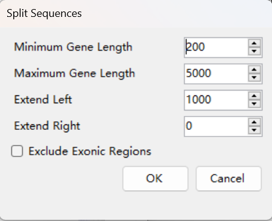
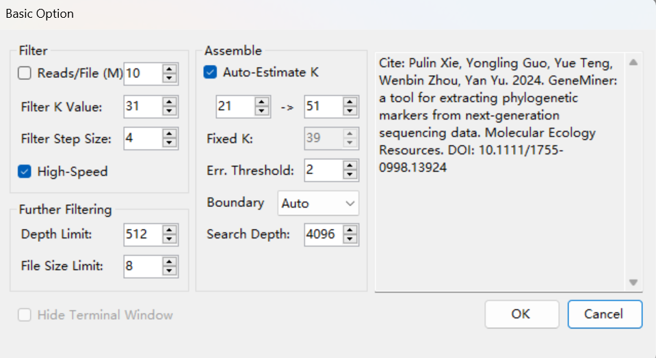
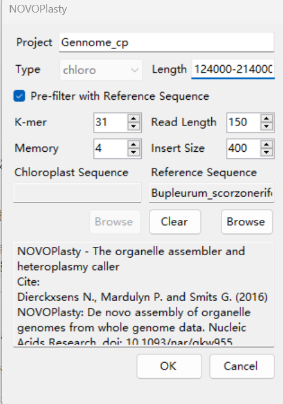
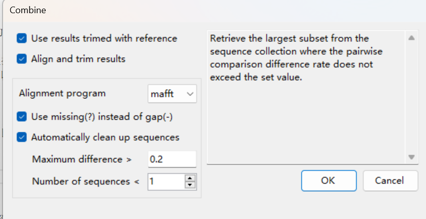

## Menu

### **Sidebar:**

**Output**: The folder for saving results, defaulting to the results folder in the directory where the GeneMiner2 application is located.

**Open**: Opens the output directory in Windows Explorer.

**Change**: Select the folder where results will be saved.
**Note:** The folder for saving results may be repeatedly emptied during operation, so be sure not to choose a folder containing important files. It is recommended to create a new folder for output with each analysis. If the same output folder is selected to continue previous analyses, opt not to clear the folder in subsequent analyses.

**Threads**: Default is 7, with a maximum of the computer's logical processors minus two. Threads can be decided based on the individual's computer cores.

---
### File:

**[File > Load References]**: Choose reference sequence files in either fasta or genbank format; multiple reference sequence files can be selected at once.

If a genbank format file is selected, you can choose whether to import it as a gene list. If so, GeneMiner will automatically decompose the genes according to gene names, and the following settings dialog will pop up:

* Minimum Gene Length: The minimum length of genes to process

* Maximum Gene Length: The maximum length of genes to process

* Extend Left/Right: The length to extend on each side of a gene (the extended intron region length)
  
* Exclude Exonix Region :Exon regions can be removed, retaining only the selected length of the intron regions.

* Note: GeneMiner2 is designed to filter and assemble sequences that include exon regions; it is not recommended to directly import intron regions as reference.

**[File > Load Sequencing Files]**: Load second-generation sequencing data files, which can be in .gz or .fq format. For paired sequence files, select two files (even number) simultaneously to load. If only one file is selected, it will be loaded as single-end sequencing data.

**[File > Download References >  Plant Chloroplast Genome]**  
**[File > Download References >  Plant Mitochondrial Genome]**  
**[File > Download References >  Animal Mitochondrial Genome]**:
Retrieve organelle genomes from the software's local database for reference sequence import. The local database is populated with data from NCBI ([NCBI](https://www.ncbi.nlm.nih.gov/)).

Enter the Latin taxonomic name of the genus or higher taxonomic rank in the input box, select the taxonomic group below, and click the >> button to add it to the list on the right.

**Note**: If the taxonomic group you are researching is not found, this means it is not available in the software's local database; please select a higher taxonomic rank as a substitute.

After downloading, the reference sequence will appear in the reference sequence list and can be used directly for analysis. It is recommended to use **[File > Export References]** to export a backup to avoid repetitive downloads.

- Search Below Genus Level : Only displays taxa related to the genus level. If unchecked, it defaults to showing taxa at the genus level and above. It is recommended to check this option.
- Download as Single Gene: Downloads the entire chloroplast genome sequence in fasta format. If unchecked, it defaults to downloading the entire chloroplast genome in gb format, which will be split into multiple gene reference sequences for import. 

**[File > Download Sequences > Angiosperms 353 Genes]**: Retrieve the Angiosperms353 Gene Set (AGS) from the software's local database for reference sequence import. The local database sources data from the Kew Tree of Life Explorer ([Kew Tree of Life](https://treeoflife.kew.org)).

**[File > Export References]**: Choose an output folder to export the selected reference genes in fasta format.

**[File > Export Sequencing Files]**: Select an export folder, set the number of reads to skip, and the number of reads to preserve (export) in the popup dialog. For each pair of sequencing files, the exported files are named *.1.fq and *.2.fq (* is the sequence name).

**[File > Export List]**: Specify the filename and location to save the reference sequence information list in CSV format.

**Note**: If exporting within the same folder, change the names of previously exported sequences to avoid overwriting them.

**[File > Save Project]**: Save the data imported into the software in .geneminer format.

**[File > Open Project]**: Directly import previously loaded data (including references, result directories, and sequencing sequences).

---

### Analysis:

**[Analysis > Filter > Filter from Scratch]**: Use references to batch filter sequencing data, obtaining reads associated with target genes. The fq files of filtered results are saved in the 'filtered' folder within the output directory. If the filtering depth is too high or the files are too large, further filtering is recommended. Upon completion, the estimated depth of the filtered results will be displayed on the main interface list, and users can check the size of each gene's filtered file in the 'filtered' folder of the output directory.

**[Analysis > Filter > Further Filter]**: Perform further filtering on data that is too large or too deep in the filtered results. Original data that is too large or too deep is stored in the 'large_files' folder, and data after further filtering is saved in the 'filtered' folder.

**[Analysis > Assemble]**: Perform assembly using the filtered sequences, with the final results saved in the 'results' folder of the output directory.

**[Analysis > Filter & Assemble]**: Automatically complete all steps of filtering, (further filtering), and assembly using the current settings, with all results saved in the output directory.

Parameter settings will appear during the above steps, with specific meanings as follows:

#### **Basic Option:**

##### **Filter:**

**Reads/File (M)**: Set the amount of read length used for each sequencing file during the filtering process, measured in M (2^20). It is generally recommended to select all read lengths to achieve the best and most comprehensive extraction results.

**Filter K-value**: The k-mer value used during the initial filtering process to decompose the reference sequence and reads, default is 31. If there are no results, consider lowering the filter K-value. The K-value must be greater than 17.

**Filter Step Size**: The step size of the sliding window when cutting k-mers.

For example, with a filter K-value of 7 and a step size of 1, the segmentation of reads is as follows:

**High Speed **: Consider reverse complementary sequences when generating the reference sequence dictionary. Selecting this option will use more memory but can significantly improve filtering speed, recommended for computers with large memory.

##### **Further Filter:**

**Depth Limit**: For the filtered fq files, if the estimated filter depth (shown in the Filter Depth column) exceeds this value, increase the K-value and refilter during further filtering. Where, Filter Depth = reads sequencing length * number of filtered reads / average length of the reference sequence.

**File Size Limit**: For the filtered fq files, if the file size exceeds this value, increase the K-value and refilter during further filtering.

For example, under default parameters, if the filter result file depth exceeds 512 or fq file size is greater than 8MB, further filtering is needed.

##### **Assemble:**

**Auto Estimate K**: Dynamically estimate suitable k-mer values for each gene during assembly. Recommended to check.

**Fixed Assembly K-mer Value**: A specified k-mer value is used for all genes during the assembly process. The minimum value is 19, and it is recommended to use an odd number if manually specified to avoid assembly errors in reverse complementary regions.

**Error Threshold**: The error threshold is a parameter used to evaluate the occurrence frequency of the current assembled sequence in the filtered reads. As the assembly progresses, the sequence becomes longer and may encounter more variant sites, reducing the number of matching sequences. If the occurrence frequency of the current assembled sequence falls below the specified error threshold, the tool will stop the assembly. Setting a higher error threshold can improve the accuracy of the assembly but may limit the assembled sequence length. The default value is recommended, but for datasets with fewer reads, consider lowering this threshold.

**Boundary**: Default is Auto, which can remove low-quality sequences from short sequences. Setting to unlimit will yield the maximum extended result. Setting to 0 will remove all low-quality sequences.

**Search Depth**: Default is 4096.

**[Analysis > Trim With Referece]**: Use BLAST to trim low-quality sequences at both ends based on the source of the reference sequence and filter the sequences according to set thresholds. When the sequencing and reference sequence sources differ (for example, using genomic data with a transcriptome reference), it is recommended to set this value to 0 to prevent over-filtering. When the sources are the same, the default value of 50% is recommended. The trimmed results are saved in the 'blast' folder.

**[Analysis > Iteration > First Iteration]**: Use the sequences in `contigs_all` from the output directory as the reference sequence, and re-execute all filtering and assembly processes. The results are saved in the `iteration` folder in the output directory. Running this can enhance the length and accuracy of the sequences.

**[Analysis > Iteration > Cover with Iteration]**: Replace the result files in `results` with the post-iteration result files.

**[Analysis > Iteration > Multiply Iteration]**: Perform multiple iterations to enhance the length and accuracy of the sequences.

**[Analysis > Get Best Reference]**：Split reads into kmers and align them with the kmer hash table of the reference sequence. When multiple reference sequences exist for a target gene, the reference with the highest number of matching kmers is selected as the best reference sequence.

**[Analysis > Generate Consensus]**: Map the result sequences to the filtered fq files. Set the threshold according to the prompts; increasing the threshold will increase the number of ambiguous bases. If you want to differentiate mixed sequences, it is recommended to choose the default (0.75), and if you want results without degenerate bases, it is recommended to choose 0.25.

**[Analysis > MultiCopy Detection]**: Map the gene sequences of a single species in `results`, screen for heterozygous sites, and detect multi-copy genes.

**[Analysis > Plant Chloroplast Genome]**: GeneMiner uses NOVOPlasty for organelle genome assembly. The software provides downloadable chloroplast genome sequences of closely related species as reference sequences and selects a closely related one as the seed sequence, which can resolve issues with inverted repeats in chloroplast regions. After loading the data file, the chloroplast genome assembly can begin. Typically, the default parameters are sufficient. For more detailed default settings, manually edit the `NOVO_config.txt` file in the `analysis` directory of the application package. Be careful not to delete content between $ symbols. Click the confirm button to start, and all results will be saved in the `Organelle` folder in the output directory.

**[Analysis > Plant Mitochondrial Genome]**: GeneMiner uses NOVOPlasty for organelle genome assembly. **Previously assembled chloroplast genomes must be selected**, then load the data file to begin the mitochondrial genome assembly. Typically, the default parameters are sufficient. The software provides downloadable mitochondrial genome sequences of closely related species as reference sequences, which can resolve issues with inverted repeats in mitochondrial regions. For more detailed default settings, manually edit the `NOVO_config.txt` file in the `analysis` directory of the application package. Be careful not to delete content between $ symbols. Click the confirm button to start, and all results will be saved in the `Organelle` folder in the output directory.

**[Analysis > Animal Mitochondrial Genome]**: GeneMiner uses NOVOPlasty for organelle genome assembly. The software provides downloadable mitochondrial genome sequences of closely related species as reference sequences and selects a closely related one as the seed sequence; then load the data file to begin the chloroplast genome assembly.

NOVOPlasty settings can be adjusted based on computer configuration to increase the allowable maximum memory for enhanced speed. For detailed explanations of the parameters, see [NOVOPlasty Github](https://github.com/ndierckx/NOVOPlasty).

**Note: Do not close the command line window midway.**

**[Analysis > Find Single Copy Genes]**: Transcript data needs to be imported as the reference sequence, and single-copy genes are extracted from the imported transcripts, which will subsequently be used as reference sequences for extracting single-copy genes from shallow sequencing.

---

### Batch

**[Batch > Filter & Assemble]**: Perform batch analysis on selected sequencing files from different species, automatically completing all steps of filtering, (further filtering), and assembly using the current settings. All results are saved in the output directory named after the sequencing file names.

**[Batch > Re-Assemble]**: Perform batch analysis on selected sequencing files from different species, reassembling using the current settings.

**[Batch > Trim With Referece]**: Use BLAST to trim low-quality sequences at both ends based on the source of the reference sequence and filter the sequences according to set thresholds. When the sequencing and reference sequence sources differ (for example, using genomic data with a transcriptome reference), it is recommended to set this value to 0 to prevent over-filtering. When the sources are the same, the default value of 50% is recommended. The trimmed results are saved in the 'blast' folder.

**[Batch > Combine Results]**: Merge the results of batch analyses and perform multiple sequence alignment and trimming on the merged fasta file.

**[Batch > Build Phylogenetic Tree]**: Construct a phylogenetic tree based on merged results. The general workflow includes: [Load references and sequencing Files], [Filter & Assemble], [Trim With Reference], [Combine results], **[Build Phylogenetic Tree]**. Concatenated/coalescent-based trees can be chosen for construction, and rooted trees can be supported with the selection of an outgroup.

**[Batch > Generate Consensus]**: Map the filtered fq files of selected species in batch to the result sequences. Set the threshold according to prompts; increasing the threshold will result in a higher number of ambiguous bases.

For specific values for threshold settings, see **[Analysis Menu]**.

**[Batch > Multi-Copy Detection]**: Perform multi-copy gene detection on the extracted result sequences for each species.

**[Batch > Paralogous Detection (PPD)]**: **Note, PPD can only be performed after Consensus Reconstruction**, i.e., after paralogous parity detection on the results extracted from [Filter & Assemble]. An outgroup sequencing file ID number is required.

**[Batch >Plant Chloroplast Genomes]**: Perform batch chloroplast genome assembly on selected sequencing files from different plant species.

**[Batch > Plant Mitochondrial Genomes]**: Perform batch mitochondrial genome assembly on selected sequencing files from different plant species.

**[Batch > Animal Mitochondrial Genomes]**: Perform batch mitochondrial genome assembly on selected sequencing files from different animal species.

Note: For numerical choices and download standards regarding organelle genome assembly, see the above **[Analysis]**.

**[Batch > Summary Stastistics]**: Compile the results of filtering, assembly, consensus reconstruction, and paralogous parity analysis.

---

## References

Dierckxsens N., Mardulyn P. and Smits G. (2016) NOVOPlasty: De novo assembly of organelle genomes from whole genome data. Nucleic Acids Research, doi: 10.1093/nar/gkw955

Dierckxsens N., Mardulyn P. and Smits G. (2019) Unraveling heteroplasmy patterns with NOVOPlasty. NAR Genomics and Bioinformatics, https://doi.org/10.1093/nargab/lqz011

Zhen Zhang, Pulin Xie, Yongling Guo, Wenbin Zhou, Enyan Liu, Yan Yu. Easy353: A tool to get Angiosperms353 genes for phylogenomic research. Molecular Biology and Evolution. msac261 (2022). https://doi.org/10.1093/molbev/msac261.

Baker W.J., Bailey P., Barber V., Barker A., Bellot S., Bishop D., Botigue L.R., Brewer G., Carruthers T., Clarkson J.J., Cook J., Cowan R.S., Dodsworth S., Epitawalage N., Francoso E., Gallego B., Johnson M., Kim J.T., Leempoel K., Maurin O., McGinnie C., Pokorny L., Roy S., Stone M., Toledo E., Wickett N.J., Zuntini A.R., Eiserhardt W.L., Kersey P.J., Leitch I.J. & Forest F. A Comprehensive Phylogenomic Platform for Exploring the Angiosperm Tree of Life. Systematic Biology. 71: 301–319. https://doi.org/10.1093/sysbio/syab035.

Wenbin Z,John S,Jenny Q X. A New Pipeline for Removing Paralogs in Target Enrichment Data.[J]. Systematic biology,2021,71(2).

