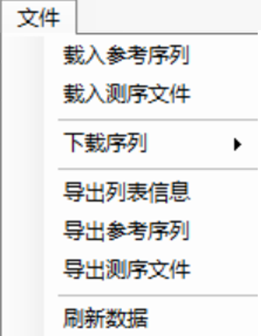
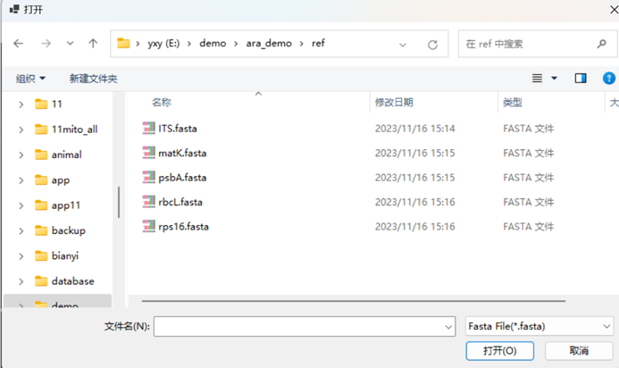
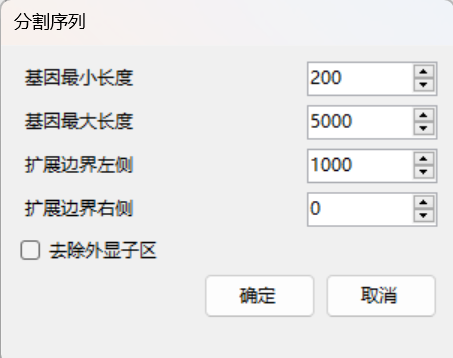
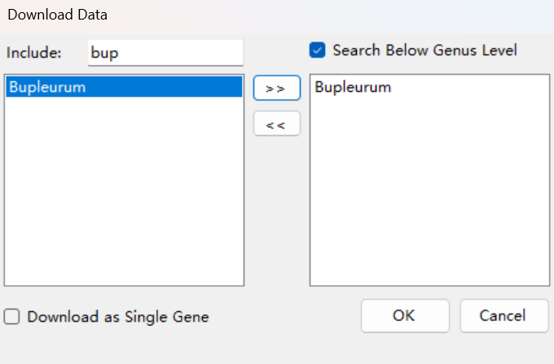
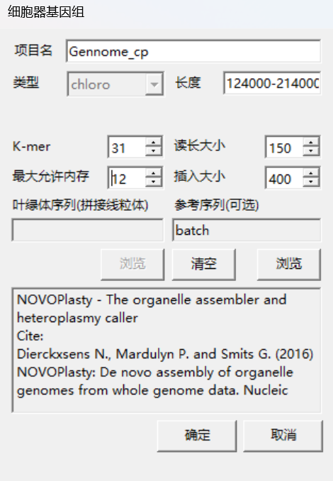
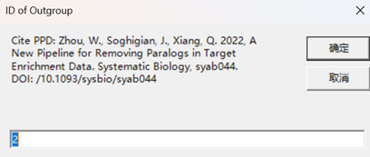

## 菜单

### **侧边栏：**

**输出目录**: 保存结果的文件夹，默认为GeneMiner应用程序所在目录的results文件夹。

**打开目录**: 在Windows资源管理器中打开输出目录。

**更改目录**: 选择保存结果的文件夹。**注意:** 保存结果的文件夹在运行过程中可能被反复清空，请务必不要选取保存有资料的文件夹。建议每次分析都新建文件夹进行输出。如果为了延续之前的分析而选取同样输出文件夹，请在后续的分析中选择不清空文件夹。

**进程数量**：默认为7，最大值为电脑逻辑处理器减一。可自行根据个人电脑内核决定进程数量。

---

###  文件菜单：

**[文件>载入参考序列]** :选择fasta或者genbank格式的参考序列文件，可以一次选择多个参考序列文件。

在打开对话框中，右下角可以切换待选取的数据类型:

如果选择了genbank格式的文件，GeneMiner会对其中的基因按照基因名自动分解，会弹出如下设置对话框: 

 

* 基因最小长度：要处理的基因的最小长度

* 基因最大长度：要处理的基因的最大长度

* 扩展边界长度：在每个基因两侧延展的长度（扩展的内含子区长度）

**[文件>载入测序文件]** :载入二代测序的数据文件，文件格式为.gz或.fq。对于配对(paired)的序列文件，需要同时选中两个（偶数个）数据文件一起载入，如只选取一个，则会作为单端测序数据载入。

**[文件>下载序列>下载植物叶绿体基因组]  [文件>下载序列>下载植物线粒体基因组]** **[文件>下载序列>下载动物线粒体基因组]**：：

从软件本地数据库获取细胞器基因组作为参考序列导入。本地数据库从NCBI（https://www.ncbi.nlm.nih.gov/）获取数据。

 

在输入框中输入属或以上分类阶元的拉丁学名，在下方选中类群，点击>>按钮添加到右侧列表中。

**注意：如果找不到您所研究的类群，这意味着该类群在软件本地数据库没有数据，请选择更高分类阶元的类群代替。**

下载完成后会在参考序列列表中显示，可直接作为参考序列分析。建议使用[文件>导出参考序列]导出备用，以免重复下载。

* 不在属以上搜索：仅显示属级相关分类阶元。不勾选默认显示属级及以上分类阶元。建议勾选。

* 作为单个基因下载：将下载fasta格式的叶绿体全基因组序列。不勾选默认下载gb格式的叶绿体全基因组序列，将分割为多条基因参考序列导入。建议不勾选。

**[文件>下载序列>下载被子植物353基因]**：从软件本地数据库获取Angiosperms353 Gene Set (AGS)作为参考序列导入。本地数据库从Kew Tree of Life Explorer (https://treeoflife.kew.org)获取数据。

**[文件>导出列表信息]** 指定要保存的文件名，将参考序列信息列表保存为csv格式。

**[文件>导出参考序列]** 选择输出文件夹，将选取的参考基因导出为fasta格式。

**[文件>导出测序文件]** 选择输出文件夹，在弹出的对话框中设定要跳过的读长的数量，并导出在“**读长/文件(M)**”中设置的读长的数量。对于每一对测序文件，导出的文件以project*.1.fq和project*.2.fq(*为数字)命名。

**注意：如果在同一文件夹中导出，需要更改先前已经导出的序列名，否则将会被覆盖。**

**[文件>刷新数据]**: 对于关闭程序后重新进行的分析，如果输出目录和之前分析的输出目录相同，在载入同样的参考序列之后，可以重新获取之前已经得到的参考序列信息和拼接结果。

---

### 分析菜单:

**[分析>过滤>从头过滤]**: 使用参考基因对测序数据进行批量过滤，获得与目标基因关联的reads。过滤结果的fq文件保存在输出目录中的filtered文件夹中。如果过滤深度过高或文件过大，则建议进行进一步过滤。运行结束后，会在主界面列表中显示过滤结果的估算深度，用户可以在输出目录的filtered文件夹中查看每个基因过滤文件的大小。

**[分析>过滤>进一步过滤]**: 对过滤结果中过大或深度过深的数据进行进一步过滤，过大或深度过深的原始数据会储存在large_files文件夹中，filtered中则保存进一步过滤之后的数据。

**[分析>拼接]**: 使用过滤后的序列进行拼接，拼接的最终结果保存在输出目录的results文件夹中。

**[分析>过滤&拼接]**: 使用当前设定的参数自动完成过滤、（进一步过滤）、拼接的全部步骤，所有结果保存在输出目录中。

当进行以上步骤会出现参数设定选项，具体含义如下：

#### **基础设定：**

##### **过滤：**

**读长/文件(M)**: 设置在过滤过程中，每个测序文件所使用的读长的数量（或待导出的读长数量），以M(2^20)为单位。一般建议选择全部读长以得到最好以及最全的提取结果。 

**过滤K值**: 在初次过滤过程中分解参考序列和reads时所采用的k-mer值，默认为31。如果没有结果可以选择降低过滤K值，K值必须大于17且为单数。 

**过滤步长**: 切取kmer时滑动窗口的前进的步数。

例如: 当过滤K值为7，步长为1时，对reads的切割方式如下所示:

**高速(高内存占用)**: 在生成参考序列的字典时考虑反向互补的序列。选中该选项会占用更高的内存，但可以显著提高过滤速度，推荐有大内存的电脑使用。

##### **进一步过滤：**

**深度限制**: 对于过滤得到的fq文件，如果估算过滤深度（Filter Depth列显示）超过了该值，则在进一步过滤中提高K值重新进行过滤。其中，过滤深度(Filter Depth)=reads测序长度*过滤出的reads数量/参考序列的平均长度。

**文件大小限制**: 对于过滤得到的fq文件，如果文件大小超过了该值，则在进一步过滤中提高K值重新进行过滤。

例如：在默认参数下，如果过滤结果文件深度超过512，fq文件大小大于8MB，需要进行进一步过滤。

##### **拼接：**

**自动估算拼接值(慢)**: 在拼接时对每个基因动态估算合适的kmer值。

**固定拼接K值**: 在拼接时对所有基因都使用指定的kmer值。

**错误阈值**: 在拼接过程中，不使用出现次数小于该值的kmer。

**边界**：默认为0，可以去除短序列的低质量序列。设定为unlimit将得到最大的扩展结果。

**搜索深度**：默认为1024。

**[分析>基于参考切齐]**：可选。根据参考序列比对上的部分进行切齐。如果参考序列是来自转录组，使用的测序数据是浅层，建议进行。切齐后会自动替代之前的结果序列，如果想重新得到完整序列结果需要进行[重新拼接]。

**[分析>迭代>运行迭代]**: 将输出目录中contigs_all中的序列作为参考序列，重新执行所有的过滤和拼接过程。结果保存在输出目录的iteration文件夹中。可以增强序列的长度和精度，建议运行。

**[分析>迭代>用迭代覆盖]**: 将results中的结果文件替换为迭代后的结果文件。

**[分析>迭代>多次迭代]**: 多次进行迭代操作以增强序列的长度和精度。

**[分析>一致性重构]**: 将结果序列和过滤后的fq文件进行映射。按照提示进行阈值设定，提高阈值会增加模糊碱基的数量，如果想区分混杂序列建议选择默认（0.75），如果想得到无简并碱基的结果建议选择0.25。

**[分析>多拷贝检测]**: 对results中单个物种的基因序列进行映射，筛选杂合位点，进行多拷贝基因的检测。

**[分析>植物叶绿体基因组]**: GeneMiner调用NOVOPlasty进行细胞器基因组组装，软件提供近源物种的叶绿体基因组序列下载作为参考序列并选用其中近源的作为种子序列，可以解决叶绿体重复区域的倒转重复问题；之后载入数据文件，即可进行叶绿体基因组的组装。通常保持默认参数即可。要进行更加细致的默认参数设定，可以手动编辑应用程序包analysis目录下的NOVO_config.txt文件，修改时请勿删除$及其之间的内容。点击确定按钮开始运行，所有结果将保存在输出目录的Organelle文件夹中。

**[分析>植物线粒体基因组]**: GeneMiner调用NOVOPlasty进行细胞器基因组组装，**需要选中先前拼接的叶绿体基因组**，再载入数据文件，即可进行线粒体基因组的组装。通常保持默认参数即可。软件提供近源物种的线粒体基因组序列下载作为参考序列，可以解决线粒体重复区域的倒转重复问题。要进行更加细致的默认参数设定，可以手动编辑应用程序包analysis目录下的NOVO_config.txt文件，修改时请勿删除$及其之间的内容。点击确定按钮开始运行，所有结果保存在输出目录的Organelle文件夹中。

**[分析>动物线粒体基因组]**: GeneMiner调用NOVOPlasty进行细胞器基因组组装，软件提供近源物种的线粒体基因组序列下载作为参考序列并选用其中近源的作为种子序列；之后载入数据文件，即可进行叶绿体基因组的组装。

NOVOPlasty参数设置，可以根据电脑配置调整最大允许内存来提高速度。参数具体含义详见[NOVOPlasty Github](https://github.com/ndierckx/NOVOPlasty)。

**注意: 不要中途关闭命令行窗口。**

**[分析>获取单拷贝基因]**:通过blastn提取单拷贝基因作为参考序列导入。

---

### 批量菜单

**[批量>过滤&拼接]**：对选中的不同物种的测序文件进行批量分析，使用当前设定的参数自动完成过滤、（进一步过滤）、拼接的全部步骤，所有结果以测序文件名命名保存在输出目录。

**[批量>重新拼接]**：对选中的不同物种的测序文件进行批量分析，使用当前设定的参数重新进行拼接。

**[批量>基于参考切齐]**：可选。基于参考序列根据比对上的部分进行切齐。如果参考序列是来自转录组(例如353)，使用的测序数据是浅层，建议进行这一步。切齐后会自动替代之前的结果序列，如果想重新得到完整序列结果需要进行[重新拼接]。

**[批量>合并结果]**：将批量分析的结果合并，不同物种、同一基因的分析结果将合并在一个fasta文件中。

**[批量>合并+切齐(trimAL)]**：将批量分析的结果合并，并对合并后的fasta文件进行多序列比对并切齐。

**[批量>一致性重构]**：将勾选物种过滤后的fq文件批量与结果序列进行映射。按照提示进行阈值设定，提高阈值会增加模糊碱基的数量。

阈值设定具体数值选择见**[分析菜单]**

**[批量>多拷贝检测]**: 对每个物种的提取的结果序列进行多拷贝基因的检测。

**[批量>旁系同源检测（PPD）]**：**注意，一致性重构之后才可进行PPD**，即进行[过滤&拼接]提取结果的旁系同源检测。需要输入外类群的测序文件所在的ID号。

 

**[批量>叶绿体基因组]**：对选中的不同物种的测序文件进行批量叶绿体基因组拼接。

**[批量>植物线粒体基因组]**：对选中的不同物种的测序文件进行批量线粒体基因组拼接。

**[批量>动物线粒体基因组]**：对选中的动物不同物种的测序文件进行批量线粒体基因组拼接。

**[批量>植物线粒体基因组]**：对选中的植物不同物种的测序文件进行批量线粒体基因组拼接。

注意：有关细胞器基因组拼接的数值选择和下载规范，见上述**[分析菜单]**

**[批量>统计汇总结果]**：汇总过滤、拼接、一致性重构和旁系同源分析的结果。

---

# 输出结果

**contigs_all**: 所有可能的组装结果。

**filtered**: 过滤后得到的fq文件。

**iteration**: 首次或多次迭代得到的文件，内部文件名和文件含义与上级文件夹相同。

**large_files**: 进一步过滤时超过深度限制或者文件大小限制的原始fq文件。如果所有过滤结果都在限制以内，则不会出现该文件夹。

**log.txt**: 日志文件。

#### **results：拼接结果中权重最大的序列，即最终结果。**

**kmer_dict_k31.dict**: kmer字典文件，格式为：kmer片段(十六进制)，kmer计数（十六进制）。

**result_dict.txt**: 结果文件，格式为：基因名，序列拼接状态，拼接上的reads数量。

**ref_reads_count_dict.txt**: 每个参考基因序列拆分成kmer的总条数。

**result_dict.txt**: 结果文件，格式为：基因名，序列拼接状态，拼接上的reads数量。

#### Organelle：细胞器基因组的拼接结果。

* **Gennome_cp.fasta**：植物叶绿体基因组拼接结果。

* **Gennome_cp.gb**：注释后的植物叶绿体基因组拼接结果。

* **Gennome_mito_plant.fasta**：植物线粒体基因组拼接结果。

* **temp**：因终端关闭终止分析，未完成的细胞器基因组的拼接过程文件。

* **Gennome_mito.fasta**：动物线粒体基因组拼接结果。

#### 一致性重构结果：

* **consensus**：将结果序列和过滤后的fq文件进行映射。存在设定值以上的模糊碱基数的序列将会被保留。

* **supercontigs**：一致性重构的结果文件，使用IPUAC代码生成的退化序列，使用简并碱基标注了SNP位点。

#### 多拷贝检测结果：

* **paralogs**：旁系同源基因筛选的结果文件，其中_ref.fasta文件储存旁系同源基因，csv文件记录不同位置碱基map出现的次数，.pec.csv文件记录碱基变异的频率。

**summary.csv**：统计汇总结果。

#### 批量分析结果：

**您的测序文件名**：以测序序列名命名的文件夹，储存每个测序序列分别得到的拼接结果。

**combined_results**：储存合并后的结果文件。

**combined_trimed**：储存合并并切齐后的结果文件。

**aligned**: 多序列比对的结果。

#### 旁系同源检测（PPD）结果：

**PPD>result>supercontig>s8 _rm_paralogs> Final_kept_genes**：为最终结果文件，其他文件具体含义见[PPD github](https://github.com/Bean061/putative_paralog#part2-trims-alignment-and-detectes-the-putative-paralogs)。

 ---

# 软件结果显示

#### 输出结果目录

Select: 是否使用该条参考序列。

ID: 参考基因的编号。

Name: 参考基因的名称。

Ref. Count: 参考基因的数量。

Ref. Length: 参考基因的平均长度(bp)。

Filter Depth: 使用参考基因过滤后的深度。过滤深度(Filter Depth)=reads测序长度*过滤出的reads数量/参考序列的平均长度。

Assemble State: 序列拼接的状态，包括：

* no reads: 未过滤出reads，请降低过滤K值或者提供更近源的参考序列

* distant references: 参考序列过于远源，请提供更近源的参考序列

* insufficient reads: 过滤出的reads太少，请减小过滤K值或者提供更近源的参考序列

* no seed: 无法找到合适的种子，请减小拼接K值或者提供更近源的参考序列

* no contigs: 没有拼接出结果

* low quality: 结果准确度较低，reads 不足以覆盖拼接出的结果

* success: 拼接成功

Ass. Length: 拼接结果的长度

Ass. Depth: 拼接结果的reads覆盖深度=reads测序长度*用于拼接的reads数量/拼接结果的长度

 

#### 数据列表

Select: 是否使用该组数据文件

Data1: 测序文件的左端(1端)

Data2: 测序文件的右端(2端)，如果是单端测序，则自动与Data1中的内容相同。

**注意:批量功能针对不同物种的测序序列进行分析。**

---

## 参考文献

Dierckxsens N., Mardulyn P. and Smits G. (2016) NOVOPlasty: De novo assembly of organelle genomes from whole genome data. Nucleic Acids Research, doi: 10.1093/nar/gkw955

Dierckxsens N., Mardulyn P. and Smits G. (2019) Unraveling heteroplasmy patterns with NOVOPlasty. NAR Genomics and Bioinformatics, https://doi.org/10.1093/nargab/lqz011

Zhen Zhang, Pulin Xie, Yongling Guo, Wenbin Zhou, Enyan Liu, Yan Yu. Easy353: A tool to get Angiosperms353 genes for phylogenomic research. Molecular Biology and Evolution. msac261 (2022). https://doi.org/10.1093/molbev/msac261.

Baker W.J., Bailey P., Barber V., Barker A., Bellot S., Bishop D., Botigue L.R., Brewer G., Carruthers T., Clarkson J.J., Cook J., Cowan R.S., Dodsworth S., Epitawalage N., Francoso E., Gallego B., Johnson M., Kim J.T., Leempoel K., Maurin O., McGinnie C., Pokorny L., Roy S., Stone M., Toledo E., Wickett N.J., Zuntini A.R., Eiserhardt W.L., Kersey P.J., Leitch I.J. & Forest F. A Comprehensive Phylogenomic Platform for Exploring the Angiosperm Tree of Life. Systematic Biology. 71: 301–319. https://doi.org/10.1093/sysbio/syab035.

Wenbin Z,John S,Jenny Q X. A New Pipeline for Removing Paralogs in Target Enrichment Data.[J]. Systematic biology,2021,71(2).

